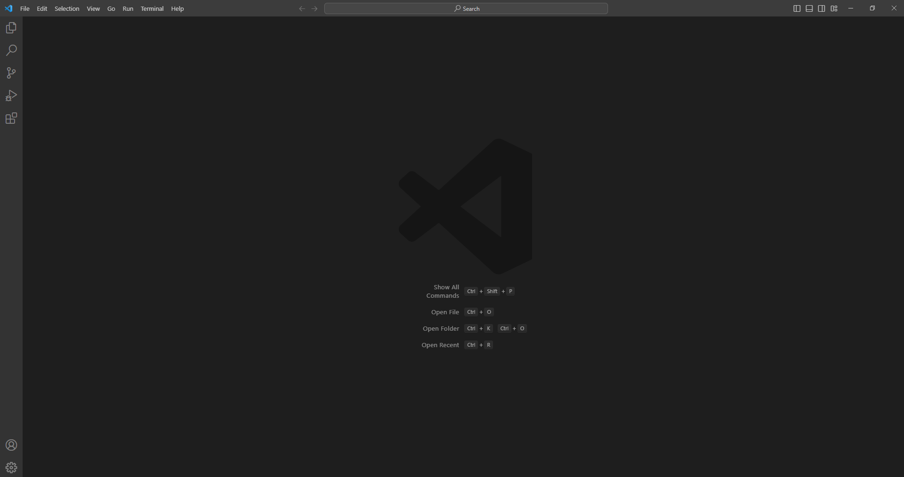
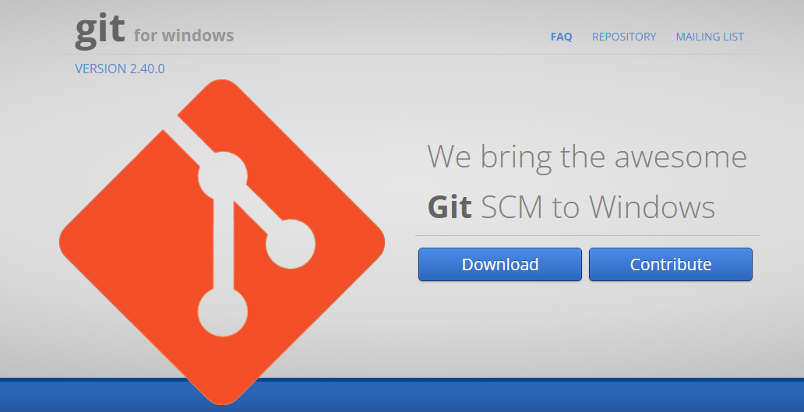
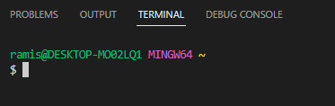
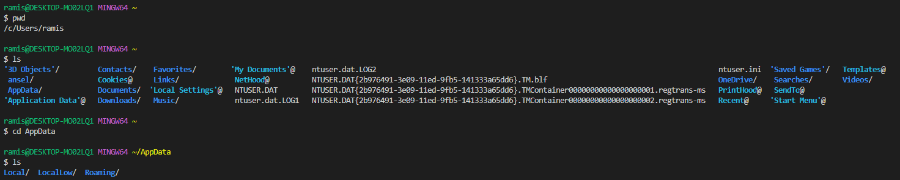

# **Lab Report 1**
Ramis Cushu

## Installing VSCode ##
Go to the [Visual Studio Code](https://code.visualstudio.com/) website and follow the instructions to install it onto your computer.

When installed, launch VSCode. You should see a window similar to this:

*Note: the window may appear different depending on system/settings, but it should be similar*

## Remotely Connecting

Before you can remotely connect, there are 2 important steps you must complete:
1. Reset your CSE15L account password
  * You can look up your CSE15L account [here](https://sdacs.ucsd.edu/~icc/index.php)
  * To reset your password follow [this tutorial](https://docs.google.com/document/d/1hs7CyQeh-MdUfM9uv99i8tqfneos6Y8bDU0uhn1wqho/edit)
  * Once your password is reset, it will take a few minutes to take effect
2. If you're on Windows, install [Git for Windows](https://gitforwindows.org/)

Run the .exe file after it's been downloaded and follow the instsructions to complete the installation.

After the installation is complete, `git bash` is ready to use in VSCode.

To set your default terminal to use `git bash` follow the steps detailed in [this post](https://stackoverflow.com/questions/42606837/how-do-i-use-bash-on-windows-from-the-visual-studio-code-integrated-terminal/50527994#50527994).

Your terminal should now look similar to this:

---

Now you can move on to establishing a remote connection. Begin by entering this command into your terminal:

``ssh cs15lyyyyzz@ieng6.ucsd.edu``

`yyyy` will be replaced with your current term (Spring 2023 = sp23, Winter 2020 = wi20, etc.) and `zz` will be replaced with the letters in your course-specific account.

Since it'll be your first time connecting to the server, you'll probably get this message or something similar:

``ssh cs15lwi23zz@ieng6.ucsd.edu
The authenticity of host 'ieng6.ucsd.edu (128.54.70.227)' can't be established.
RSA key fingerprint is SHA256:ksruYwhnYH+sySHnHAtLUHngrPEyZTDl/1x99wUQcec.
Are you sure you want to continue connecting (yes/no/[fingerprint])? 
``

This is normal whenconnecting to a new server for the first time, and you can type `yes`.

`Password:` should now have appeared in the terminal, and you can enter the password you set for your CSE15L account

*Note: the text will not be displayed as you enter your password, this is normal and is a measure for privacy*

---

Now you'll be connected to the server in the CSE basement, and any commands you run will run on that computer.

## Running Commands

At this point, you can try running some commands both on your computer, and on the remote computer after ssh-ing (use the terminal in VScode). Some commands you can try are
* `cd` 
* `ls`
* `pwd` 
* `mkdir`
* `cp`
* `cat`

Try running these commands in different ways to see what output they produce.

Example:

---

To log out of the terminal, you can either:
* Press Ctrl + D
* Run the command `exit`
