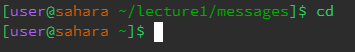
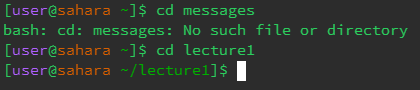
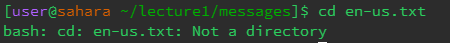

# **Lab Report 1**

## Commands

`cd`

When cd is used with no arguements, your current directory is changed to the home directory.

When cd is used with a path to a directory, it will change your directory to the specified directory IF it is present in your current directory.

When cd is used with a path to a file, it will produce an error as the command is only intended to be used with directories.

***ls***

