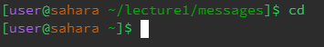
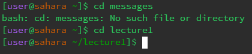
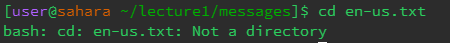
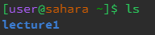
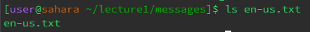
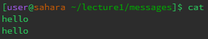
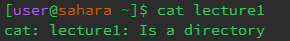

# **Lab Report 1**

## Commands

`cd`

---

When `cd` is used with no arguements, your current directory is changed to the home directory. No error is produced.

Working directory: `/home/lecture1/messages`  

When `cd` is used with a path to a directory, it will change your directory to the specified directory IF it is present in your current directory, if not, it will produce an error.

Working directory: `/home`

When `cd` is used with a path to a file, it will produce an error as the command is only intended to be used with directories.

Working directory: `/home/lecture1/messages`

---

`ls`

---

When `ls` is used with no arguments, it lists the directories/files present within your current directory. No errors are reported.

Working directory: `home`

When `ls` is used with a path to a directory, as long as the specified directory is present within your current directory, it lists the directories/files present within that specified directory. If it is not, it will produce an error.

Working directory: `/home`

When `ls` is used with a path to a file, it will list the file name. No error is produced unless the file is not within your current directory, similar to the previous example.

Working directory: `/home/lecture1/messages`

---

`cat`

---

When `cat` is used with no arguments, it takes in a text input and prints that text back to you. No errors are produced.

Working directory: `/home/lecture1/messages`

When `cat` is used with a path to a directory, it will produce an error as the command is only intended to be used with files.

Working directory: `/home`

When `cat` is used with a path to a file, it will print the contents of that file. No error is produced unless the file that `cat` is being used on is not in the current directory.

Working directory: `/home/lecture1/messages`
