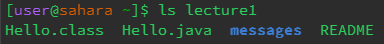
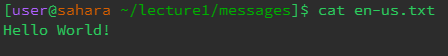

# **Lab Report 1**

## Commands

`cd`

When `cd` is used with no arguements, your current directory is changed to the home directory.

When `cd` is used with a path to a directory, it will change your directory to the specified directory IF it is present in your current directory.

When `cd` is used with a path to a file, it will produce an error as the command is only intended to be used with directories.

---

`ls`

When `ls` is used with no arguments, it lists the directories/files present within your current directory.

When `ls` is used with a path to a directory, as long as the specified directory is present within your current directory, it lists the directories/files present within that specified directory.

When `ls` is used with a path to a file, it will list the file name.

---

`cat`

When `cat` is used with no arguments, it takes in a text input and prints that text back to you.

When `cat` is used with a path to a directory, it will produce an error as the command is only intended to be used with files.

When `cat` is used with a path to a file, it will print the contents of that file.
