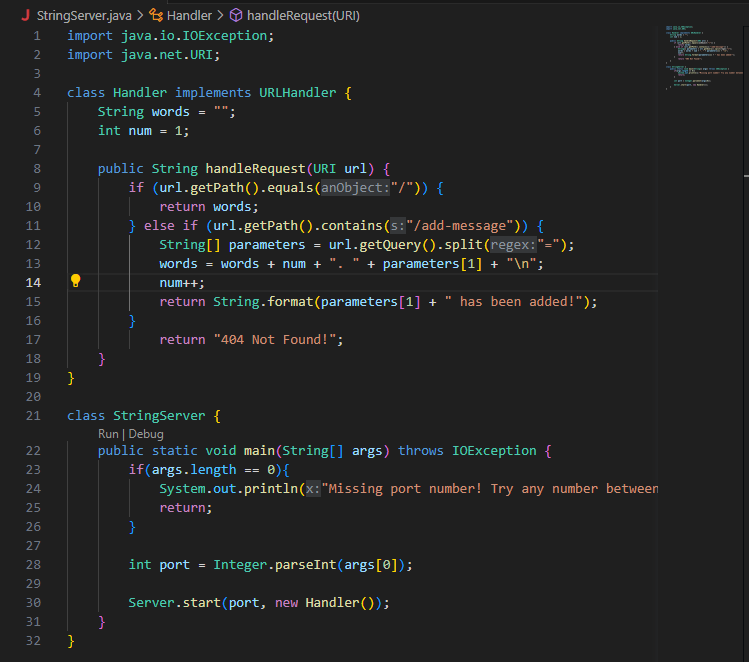
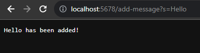
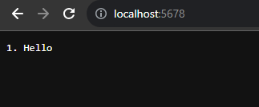
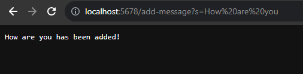
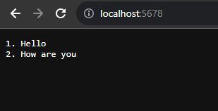
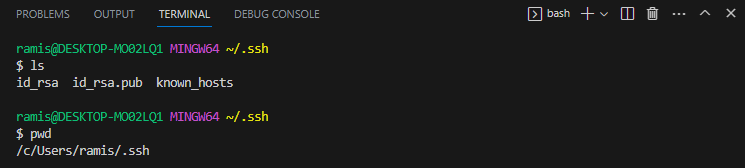
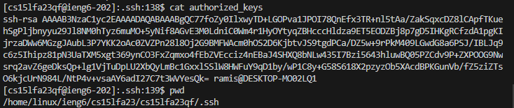
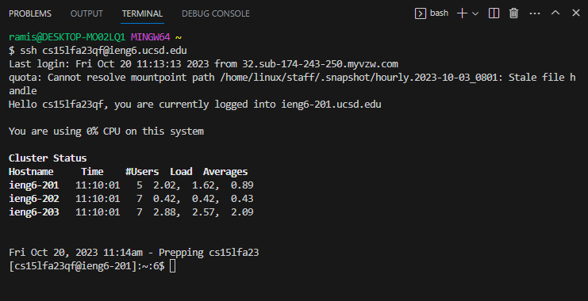

# Lab Report 2

## Part 1

**StringServer Code:**

**Adding "Hello:"**

Here, the `handleRequest` method is being called, as it is when any URL is created. The method will use the URL as the argument and, in this case, detect that the path of the URL contains `/add-message`. It will then store the message that is being added in a string array called `parameters`, which is then used to add the new word to the list. Two values change from this request: the `words` string containing the list of words, and the integer `num` which keeps track of how many words there are so it can correctly display the numbered list. Finally, the method will return a string saying that your word has been added.

**Adding "How are you:"**

`handleRequest` is once again being called and detects that the URL contains `/add-message` again. This time, the string array `parameters` will have the new message stored within it. `words` is again updated with the new string and number, `num` is incremented, and the return message is produced.

---

## Part 2

---

## Part 3

One thing I'm very glad I learned isn't directly related to any work we were assigned, but it was very useful. I figured out how to create folders within my GitHub repository to more efficiently store my lab reports and their assets.

Additionally, the first lab report taught me that I can use commands like `ls` in directories present within my current directory, not just on the current one, removing the need to `cd` into the next directory to use `ls` on it.
