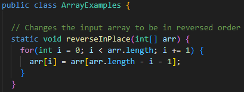
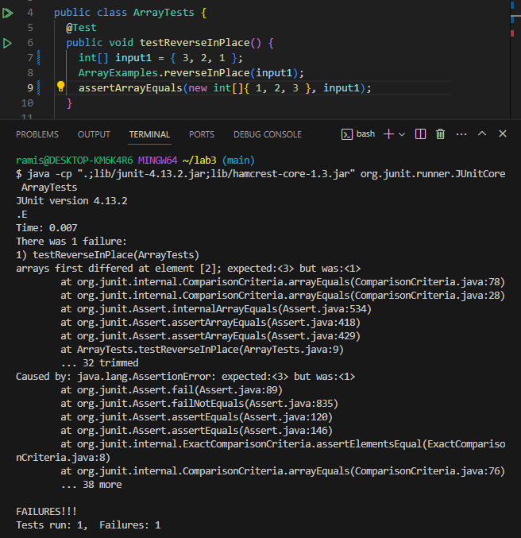
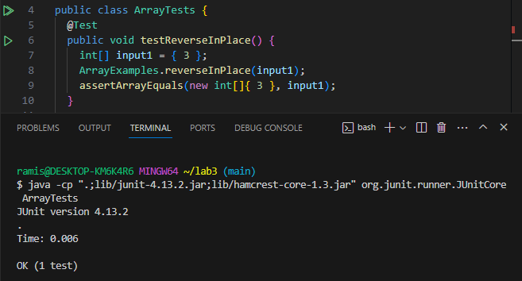

# Lab Report 3

## Part 1

### **List Examples `reverseInPlace` method:**



### Failure Inducing Input:

JUnit Test:
```
@Test 
public void testReverseInPlace() {
    int[] input1 = { 3, 2, 1 };
    ArrayExamples.reverseInPlace(input1);
    assertArrayEquals(new int[]{ 1, 2, 3 }, input1);
}
```
Input: `{ 3, 2, 1 }`

Expected:   `{ 1, 2, 3 }`

Actual:     `{ 1, 2, 1 }`

### Non-Failure Inducing Input:

JUnit Test:
```
@Test 
public void testReverseInPlace() {
    int[] input1 = { 3 };
    ArrayExamples.reverseInPlace(input1);
    assertArrayEquals(new int[]{ 3 }, input1);
}
```

Input: `{ 3 }`

Expected:   `{ 3 }`

Actual:     `{ 3 }`

### Symptom:

Failure:



No failure:



### Bug:

Before:

```
static void reverseInPlace(int[] arr) {
    for(int i = 0; i < arr.length; i += 1) {
      arr[i] = arr[arr.length - i - 1];
    }
}
```

After:

```
static void reverseInPlace(int[] arr) {
    for(int i = 0; i < arr.length / 2; i += 1) {
      int temp = arr[i];
      arr[i] = arr[arr.length - i - 1];
      arr[arr.length - i - 1] = temp;
    }
}
```

Instead of iterating through the entire list and continuing to swap when it's not needed anymore, this will instead iterate through half of the list and stop before continuing to the other half. A temporary variable is used to store the current elements value to be swapped with its counterpart later.

## Part 2

### `find` command:

### `find -name`:

```
$ find 911report/ -name *.txt  
911report/chapter-1.txt  
911report/chapter-10.txt  
911report/chapter-11.txt  
911report/chapter-12.txt  
911report/chapter-13.1.txt  
911report/chapter-13.2.txt  
911report/chapter-13.3.txt  
911report/chapter-13.4.txt  
911report/chapter-13.5.txt  
911report/chapter-2.txt  
911report/chapter-3.txt  
911report/chapter-5.txt  
911report/chapter-6.txt  
911report/chapter-7.txt  
911report/chapter-8.txt  
911report/chapter-9.txt  
911report/preface.txt  
```

```
$ find 911report/ -name preface.txt  
911report/preface.txt  
```

`find -name` checks a directory for files of certain types (as seen in the first example) or files with a specific name (as seen in the second example). This is useful for finding a file or files of certain type in large directories that would otherwise by hard to manually search through.

### `find -size`:

```
$ find 911report/ -size +400   
911report/chapter-13.4.txt  
911report/chapter-13.5.txt  
911report/chapter-3.txt  
```

```
$ find government/ -size -2  
government/  
government/About_LSC  
government/Alcohol_Problems  
government/Env_Prot_Agen  
government/Gen_Account_Office  
government/Media  
government/Post_Rate_Comm  
```

`find -size` checks a directory for files that are either above or below a certain number of blocks (indicated by the + or - preceding the desired number of blocks). This is useful for finding files above or below certain sizes.

### `find -type`:

```
$ find . -type d  
.  
./911report  
./biomed  
./government  
./government/About_LSC  
./government/Alcohol_Problems  
./government/Env_Prot_Agen  
./government/Gen_Account_Office  
./government/Media  
./government/Post_Rate_Comm  
./plos  
```

```
$ find . -type f

```
`find -type` displays certain information depending on the letter that follows it. In the first example with `d`, it is displaying all the directories and subdirectories withtin the current directory. In the second example

### `find -size`:

```
$ find . -size +200k  
./911report/chapter-13.4.txt  
./911report/chapter-13.5.txt  
./911report/chapter-3.txt  
./government/About_LSC/commission_report.txt  
./government/Env_Prot_Agen/bill.txt  
./government/Gen_Account_Office/d01591sp.txt  
./government/Gen_Account_Office/GovernmentAuditingStandards_yb2002ed.txt  
./government/Gen_Account_Office/pe1019.txt  
./government/Gen_Account_Office/Statements_Feb28-1997_volume.txt  
```

```
$ find . -size -2k  
.  
./911report  
./biomed  
./government  
./government/About_LSC  
./government/Alcohol_Problems  
./government/Env_Prot_Agen  
./government/Gen_Account_Office  
./government/Media  
./government/Post_Rate_Comm  
./plos  
./plos/pmed.0020191.txt  
./plos/pmed.0020226.txt  
```

`find -size` displays all directories, subdirectories, and files in the current directory that have are either above or below a certain size (indicated by the + or - preceding the desired size). Letters that further specify file size follow the number, such as c for bytes, k for kilobytes, and M for megabytes. This is useful for finding particularly small or large directories, subdirectories, or files.
