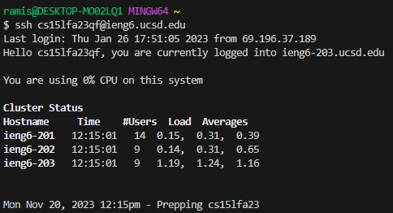
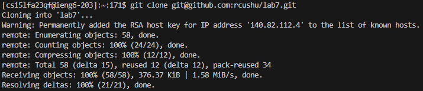
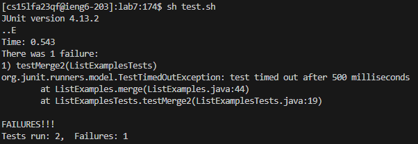
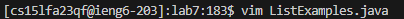
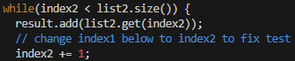
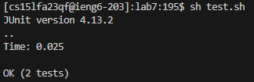

# **Lab Report 4**

## Step 4: Log into ieng6

### **Keys Pressed:** *`"ssh cs15lfa23qf@ieng6.ucsd.edu"`,  `<enter>`*

Did not have the ieng6 login previously typed, so I could not use the up arrow to access it quickly. I had to type out the login command manually.

---

## Step 5: Clone your fork of the repository from your Github account (using the SSH URL)

### **Keys Pressed:** *`"git clone"`, `<ctrl + v>`, `<enter>`*

I had the SSH URL copied to my clipboard, so once I had typed out *`"git clone"`*, I could easily paste it in to fill the rest of the command.

---

## Step 6: Run the tests, demonstrating that they fail

### **Keys Pressed:** *`"sh"`, `<space>`, `"t"`, `<tab>`, `<enter>`*

After typing out *`"sh t"`*, I could press tab to avoid filling in the rest of *`"test.sh"`*.

---

## Step 7: Edit the code file to fix the failing test

### **Keys Pressed:** *`"vim"`, `<space>`, `<shift + L>`, `<tab>`, `".java"`, `<enter>`*

This set of keystrokes is what I used to open the `ListExamples.java` file in VIM. I was able to use *`<tab>`* to fill in the rest of *`"ListExamples"`* after typing a captial L to save a bit of time.

### **Keys Pressed:** *`<shift + G>`, `<k>`, `<k>`, `<k>`, `<k>`, `<k>`, `<k>`, `<e>`, `<r>`, `<2>`, `":wq"`, `<enter>`*

After opening `ListExamples.java` in VIM, the first thing I did was pressed `*<shift + G>*` to move my cursor to the bottom of the file, near the error. Then, I pressed `*<k>*` 6 times to take the cursor to the line where the error is present. Pressing <e> took me to the end of the first word, which left my cursor directly over the number that needed to be replaced. I simply followed with `*<r>*` and `*<2>*` to replace a single character and change that character to 2, respectively. Finally, to save and exit the file, I entered `*":wq"*`.

---

## Step 8: Run the tests, demonstrating that they now succeed

### **Keys Pressed:** *`<up>`, `<up>`, `<enter>`*
