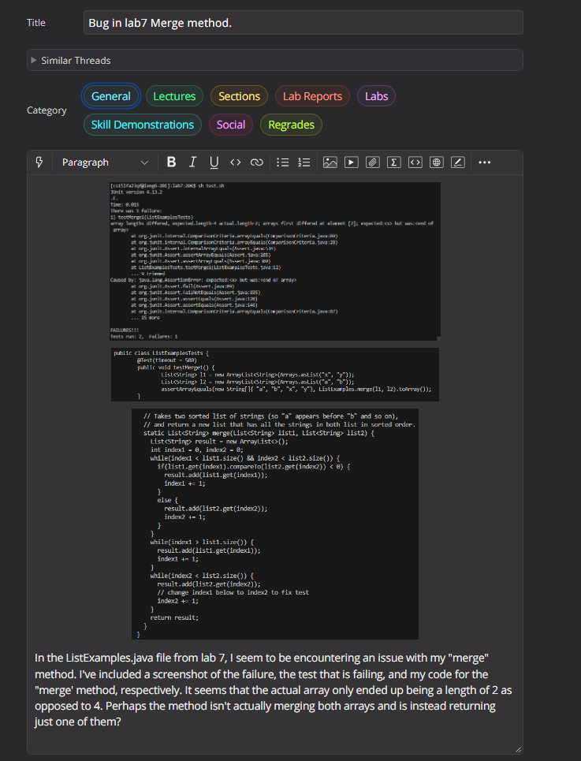
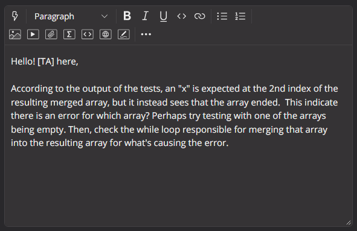
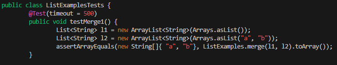
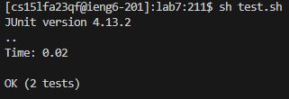
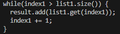

# Lab Report 5

## 1.

## 2.

## 3.

After trying what the TA suggested, it is now clear that the issue with the code is present in the `while` loop responsible for merging `list1` into `result`

Looking at the `while` loop in question, it can be seen that the `while` loop runs while `index1` is greater than the size of `list1`. `index1` begins as `0` when the method is ran, and since `index1` will never be greater than the size of `list1`, this `while` loop is never executed and the contents from `list1` are never added to `result`.
