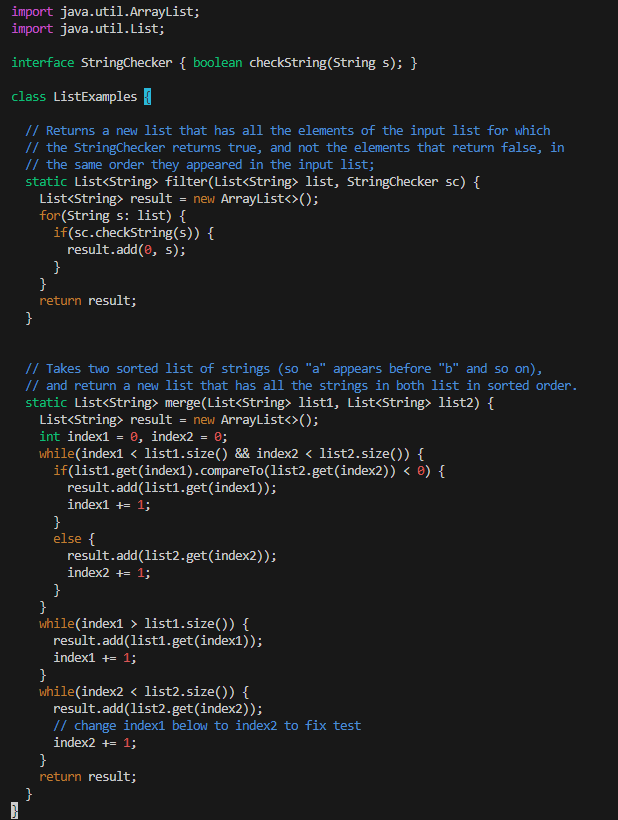
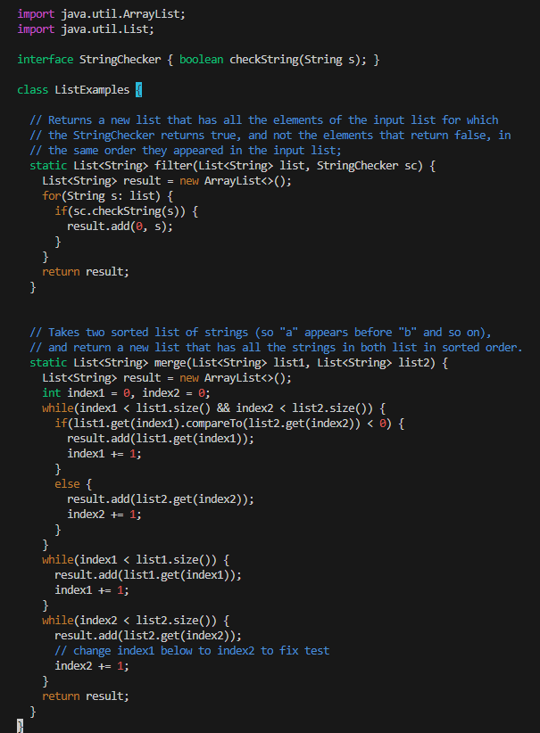

# Lab Report 5

## Part 1 – Debugging Scenario

### 1.

### 2.

### 3.

After trying what the TA suggested, it is now clear that the issue with the code is present in the `while` loop responsible for merging `list1` into `result`

Looking at the `while` loop in question, it can be seen that the `while` loop runs while `index1` is greater than the size of `list1`. `index1` begins as `0` when the method is ran, and since `index1` will never be greater than the size of `list1`, this `while` loop is never executed and the contents from `list1` are never added to `result`.

### 4.

`ListExamples.java` before the bug is fixed:

`ListExamples.java` after the bug is fixed:

## Part 2 - Reflection

Perhaps this is too broad of an answer, but learning how to use and working with Vim has not only been a very new experience, but has also been genuinely and strangely fun. I didn't think I could find enjoyment in using a text editor program, but Vim has been a real pleasure to use. And, of course, being able to edit from the command line is extremely useful.
